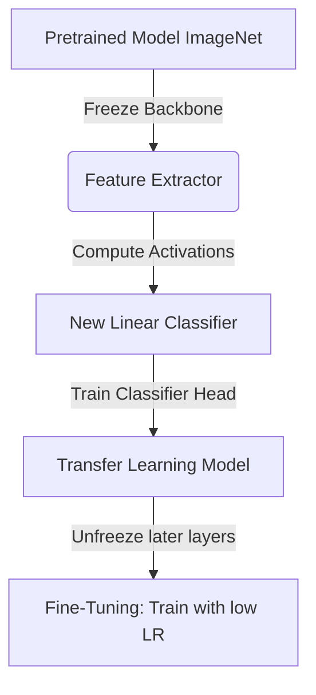

# Module 7: Convolutional Neural Networks (CNNs)

This module covers the core components, architectural concepts, and advanced methodologies of Convolutional Neural Networks (CNNs), which are standard in computer vision.

---

## 🖼️ CNN Mechanics

Traditional Feed-Forward Neural Networks (MLPs) struggle with image data because they flatten inputs, discarding spatial relationships and requiring a huge number of parameters. CNNs address this by introducing **spatial invariance** and **parameter sharing** using local receptive fields.

### 1. Image Representation
An image is represented as a 3D tensor of shape $(H, W, C)$, where:
- $H$ is Height (pixels).
- $W$ is Width (pixels).
- $C$ is Channels (e.g., $1$ for grayscale, $3$ for RGB).

### 2. Convolution Operation
A convolution layer applies a set of learnable **kernels (filters)** to the input tensor. Each kernel slides across the spatial dimensions, computing dot products between the kernel weights and the input sub-region.

$$\mathbf{S}(i,j) = (\mathbf{I} * \mathbf{K})(i,j) = \sum_{m} \sum_{n} \mathbf{I}(i-m, j-n) \mathbf{K}(m,n)$$

- **Kernels/Filters**: Small matrix weights (e.g., $3 \times 3$ or $5 \times 5$) designed to extract specific features like edges, corners, or textures.

### 3. Padding, Stride, & Output Dimensions
*   **Stride ($S$)**: The step size by which the kernel slides across the input image. A stride of 2 halves the output resolution.
*   **Padding ($P$)**: Padding (usually zero-padding) adds border pixels to the input image. It allows kernels to process edges and keeps spatial dimensions consistent.
*   **Output Shape Equation**:
    For input size $W$, kernel size $K$, padding $P$, and stride $S$:
    $$W_{out} = \left\lfloor \frac{W_{in} - K + 2P}{S} \right\rfloor + 1$$

### 4. Pooling Layers
Pooling layers reduce the spatial size of representation tensors, lowering parameter count and computation while providing translation invariance.
*   **Max Pooling** (`MaxPool2d`): Selects the maximum value from the window (extracts the most prominent features).
*   **Average Pooling** (`AvgPool2d`): Computes the average value of the window (smooths representations).

---

## 🛠️ CNN Architecture Design

A typical classification CNN is divided into two parts:
1.  **Feature Extractor (Backbone)**: Stacked Convolution, activation, normalization, and pooling layers. Early layers extract low-level features (edges, textures); deeper layers extract high-level semantic features (shapes, objects).
2.  **Classifier (Head)**: Flatten layer followed by one or more Dense layers mapping to class probabilities.

---

## 🔄 Transfer Learning & Fine-Tuning

Training deep networks from scratch requires massive data and computation. **Transfer Learning** allows us to leverage knowledge gained by a model pretrained on a giant dataset (e.g., ImageNet) and apply it to a new, smaller task.

### 1. Feature Extraction (Transfer Learning)
*   **Strategy**: Freeze all weights of the pretrained network's feature extractor (`requires_grad = False`). Replace the final classification layer (the "head") with a new linear layer matching the target task's classes.
*   **Benefit**: Extremely fast to train, requires very little data, and prevents destruction of features learned on the large dataset.

### 2. Fine-Tuning
*   **Strategy**: After training the new classification head, unfreeze a portion of the pretrained layers (usually the deepest convolutional layers) and train the entire network with a **very small learning rate** (e.g., $10^{-5}$).
*   **Benefit**: Adapts the high-level features of the backbone to the specific nuances of the new dataset, boosting final performance.

---

## 📊 Results Summary

Our script `cnn_classification.py` covers two main experiments:

1.  **Custom CNN on FashionMNIST**:
    - Stacks Conv2D, MaxPool, BatchNorm, and Dropout.
    - Generates **Feature Maps** (`feature_maps.png`) showing how a test image is filtered at the first layer.
2.  **Transfer Learning on CIFAR-10**:
    - Loads a pretrained **MobileNetV2** model.
    - Freezes the backbone and replaces the classifier head to train on CIFAR-10.
    - Unfreezes later convolution blocks and fine-tunes with a small learning rate.
    - Generates comparisons of training performance in `cnn_vs_transfer.png`.
